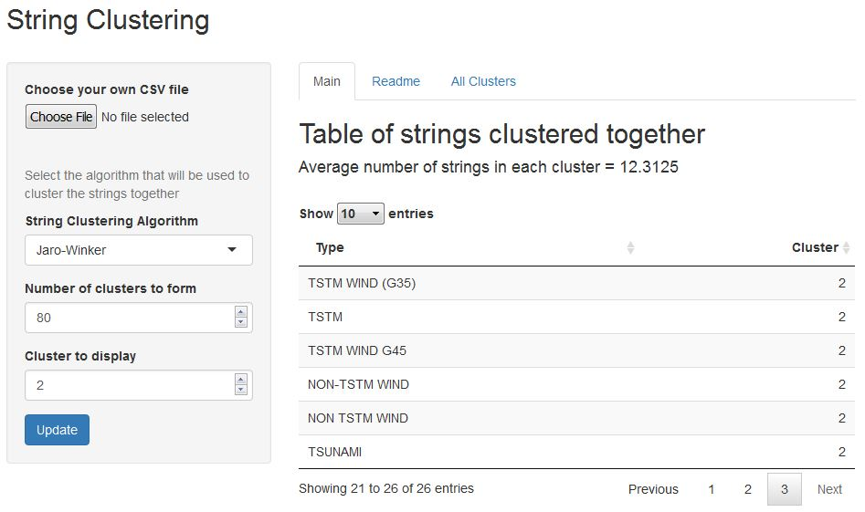

<style>
.title-slide {
     background-color: #ffffff; /* #EDE0CF; ; #CA9F9D*/
}
</style>


  

  
## Text Clustering
<br>
Many a time, your data might contain textual information that also needs to be analysed. For instance you might have a dataset where the same thing could be written in different ways by different people (color and colour for instance), and you would like them all to be treated in the same manner.   

<br>

As an example, remember the dataset from the Reproducible Research's final project, which had a column of `storm types`, which were officially supposed to be 48, but due to data entry errors, spelling mistakes, and other reasons, had more than 900 unique items listed.    

<br>

One solution in such a case is to group similar strings together, just like you group similar points together based on how close they are to each other (as done in Exploratory Data Analysis class).


--- .class #id 

## Text Clustering functioning

In the case of strings, we obviously have to use other form of distance to compute how close/similar two strings are to each other. Many algorithms exist, such as Levenshtein, Jaro-Winker, Hamming, etc, each with its own method of computing the distance between two strings. Not each works very well with every case.   

And once you have computed the distances between them using some algorithm, there is the question of "**How many clusters?**"" This again depends on the user, and different answers give different results.   

This app allows you to test all the different methods and number of clusters on your dataset to determine the best method and number of groups to cluster into.

--- 

## The App

The app allows a user to upload his own file of strings, and in case the user does not have his/her own dataset, the app uses uses the [dataset](https://d396qusza40orc.cloudfront.net/repdata%2Fdata%2FStormData.csv.bz2) used in Reproducible research by default, provided by [NOAA](https://www.ncdc.noaa.gov/stormevents/details.jsp) to showcase the string clustering mechanism.   

The user can select the algorithm to compute distance, and the number of clusters to form, and then view the result one cluster at a time or all the clusters together.   


### Contents from a sample cluster on the default dataset


```r
pander(clustered$Type[clustered$Cluster==3])
```

_HAIL_, _HAIL 1.75)_, _MARINE MISHAP_, _HAIL 75_, _HAIL 80_, _HAIL 0.75_, _HAIL 1.00_, _HAIL 1.75_, _HAIL 225_, _HAIL 0.88_, _HAIL 88_, _HAIL 175_, _HAIL 100_, _HAIL 150_, _HAIL 075_, _HAIL 125_, _HAIL 200_, _HAIL DAMAGE_, _HAIL 088_, _HAIL ALOFT_, _HAIL 275_, _HAIL 450_, _RAIN (HEAVY)_ and _MARINE HAIL_

All of these are now considered one group! It is not perfect, but gets the job done.   

---

## App interface




